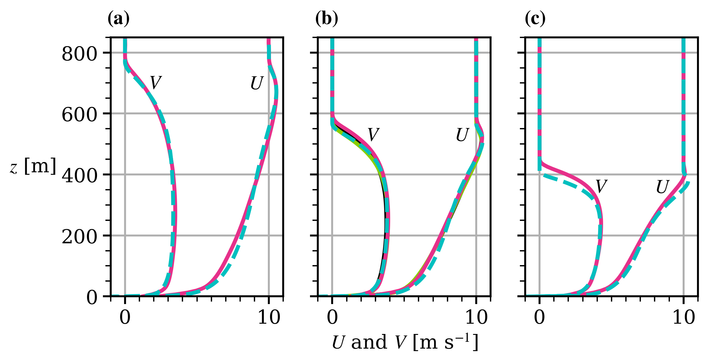

# Modelling-of-CNBLs-with-an-EARSM

Data used in the article "Modelling of conventionally neutral boundary layers with an explicit algebraic Reynolds stress model" [(Baungaard & Wallin, 2025)](https://www.researchsquare.com/article/rs-7989013/v1)[1](#Baungaard2025).

## LES

The LESs were kindly run by Linnea Huusko with a similar setup as in [Huusko et al. (2025)](https://doi.org/10.1029/2025MS005233)[2](#Huusko2025). It was mainly the Nek5000 code with the TKE SGS closure.

- $`\Gamma = 1`$ K/km case: Nek5000 (TKE SGS closure)
- $`\Gamma = 3`$ K/km case: Nek5000 (TKE SGS closure), Nek5000 (Vreman SGS closure), and NCAR code.
- $`\Gamma = 9`$ K/km case: Nek5000 (TKE SGS closure)

The raw data for the $`\Gamma = 3`$ K/km case can be found [here](https://bolin.su.se/data/huusko-2025-les-nek5000-1). Each Nek5000 simulation took approximately 20000 core-hours to run (on the Dardel cluster).

## EVM and EARSM

A Python solver (described in the paper) was used for the EVM and EARSM simulations. Each simulation took approximately 25 seconds to run on a Apple M4 pro laptop.

## Plots

A python script, `plot_data.py`, is included.

## References

<a name="Baungaard2025">[1]</a> Mads Baungaard & Stefan Wallin (2025), [*Modelling of conventionally neutral boundary layers with an explicit algebraic Reynolds stress model*](https://www.researchsquare.com/article/rs-7989013/v1), Preprint

<a name="Huusko2025">[2]</a> Linnea Huusko et al. (2025), [*Large eddy simulation of canonical atmospheric boundary layer flows with the spectral element method in Nek5000*](https://doi.org/10.1029/2025MS005233), Journal of Advances in Modeling Earth Systems

